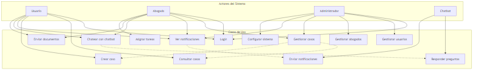
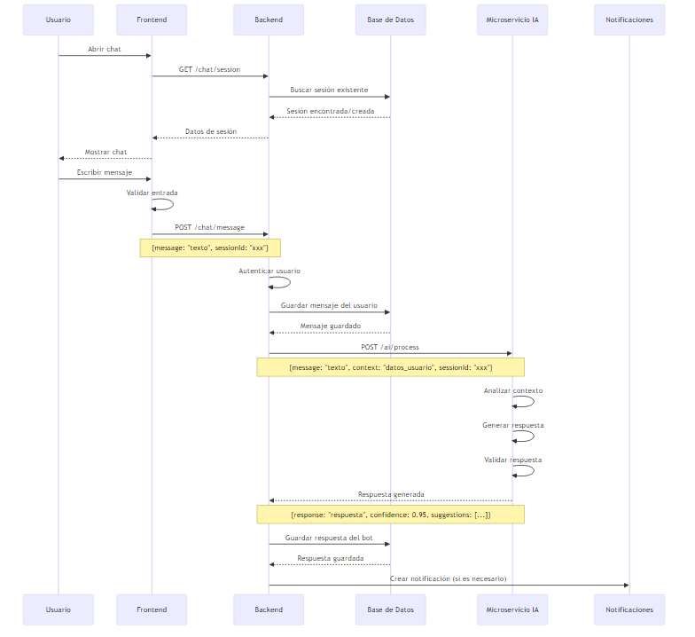
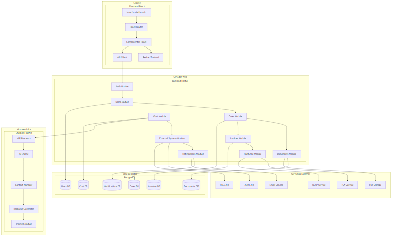
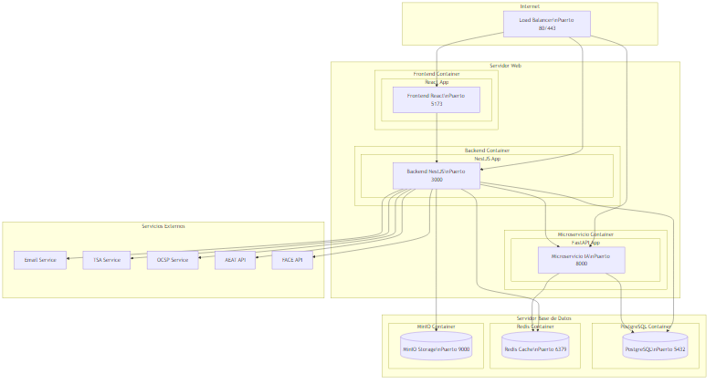
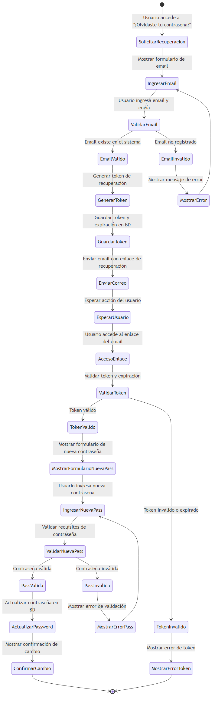
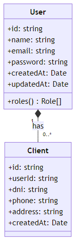

# Resumen de Diagramas del Sistema Legal

## Diagramas Generados Exitosamente

### 1. Diagrama de Casos de Uso

**Descripción:** Muestra los actores principales del sistema (Usuario, Abogado, Administrador, Chatbot) y sus casos de uso correspondientes.

**Importancia:** Define claramente quién puede hacer qué en el sistema, estableciendo los límites de funcionalidad para cada tipo de usuario.

**Requisitos implementados:**
- Autenticación y autorización por roles
- Gestión de casos legales
- Sistema de notificaciones
- Chatbot de asistencia
- Gestión de documentos
- Administración del sistema

### 2. Diagrama de Secuencia - Interacción Usuario-Chatbot

**Descripción:** Ilustra el flujo completo de comunicación entre un usuario y el chatbot, incluyendo la interacción con el backend y el microservicio de IA.

**Importancia:** Demuestra la arquitectura de comunicación en tiempo real y el procesamiento de mensajes del chatbot.

**Requisitos implementados:**
- Comunicación en tiempo real
- Procesamiento de lenguaje natural
- Gestión de sesiones de chat
- Integración con microservicios
- Notificaciones automáticas

### 3. Diagrama de Arquitectura del Sistema

**Descripción:** Representa la arquitectura completa del sistema, incluyendo frontend, backend, microservicios, base de datos y servicios externos.

**Importancia:** Muestra la estructura técnica del sistema y cómo se comunican los diferentes componentes.

**Requisitos implementados:**
- Arquitectura de microservicios
- Frontend React con gestión de estado
- Backend NestJS modular
- Base de datos PostgreSQL
- Integración con servicios externos (email, almacenamiento, APIs)
- Sistema de autenticación JWT

### 4. Diagrama de Despliegue

**Descripción:** Muestra la infraestructura de despliegue, incluyendo contenedores, puertos y servicios externos.

**Importancia:** Define cómo se despliega el sistema en producción y la configuración de red.

**Requisitos implementados:**
- Contenedores Docker
- Load balancer
- Base de datos PostgreSQL
- Cache Redis
- Almacenamiento MinIO
- Integración con servicios externos (TSA, OCSP, AEAT, FACE)

### 5. Diagrama de Actividad - Recuperación de Contraseña

**Descripción:** Ilustra el flujo completo del proceso de recuperación de contraseña, incluyendo validaciones y notificaciones por email.

**Importancia:** Demuestra la implementación de funcionalidades de seguridad y recuperación de acceso.

**Requisitos implementados:**
- Sistema de recuperación de contraseña
- Validación de tokens
- Envío de emails
- Validación de entrada de datos
- Gestión de sesiones seguras

### 6. Diagrama de Clases

**Descripción:** Muestra la estructura de clases del sistema, incluyendo la clase User con sus atributos y métodos, y su relación con la clase Client.

**Importancia:** Define la estructura de datos y las relaciones entre entidades del sistema, proporcionando una base sólida para el desarrollo y mantenimiento.

**Requisitos implementados:**
- Modelo de datos estructurado
- Relaciones entre entidades
- Gestión de usuarios y clientes
- Tipado de datos (string, Date, arrays)
- Encapsulación de atributos y métodos

**Sintaxis utilizada:** Se empleó una sintaxis específica de Mermaid que es compatible con las versiones actuales:
- Atributos con tipos: `+id: string`
- Métodos con tipos de retorno: `+roles() Role[]`
- Relaciones con cardinalidad: `"1" *-- "0..*"`
- Formato de tipos estándar: `string`, `Date`

## Cómo los Diagramas Reflejan los Requisitos Implementados

### Funcionalidades Principales
1. **Gestión de Usuarios y Autenticación:** Reflejado en el diagrama de casos de uso y el diagrama de actividad
2. **Gestión de Casos Legales:** Visible en todos los diagramas de casos de uso y arquitectura
3. **Sistema de Chatbot:** Detallado en el diagrama de secuencia y casos de uso
4. **Facturación Electrónica:** Representado en la arquitectura con servicios externos
5. **Gestión de Documentos:** Incluido en casos de uso y arquitectura
6. **Notificaciones:** Presente en secuencias y casos de uso

### Aspectos Técnicos
1. **Arquitectura de Microservicios:** Claramente definida en el diagrama de arquitectura
2. **Base de Datos:** Especificada en arquitectura y despliegue
3. **Seguridad:** Implementada en casos de uso y diagrama de actividad
4. **Escalabilidad:** Considerada en el diagrama de despliegue
5. **Integración Externa:** Detallada en arquitectura y despliegue

## Conclusión

Los **6 diagramas generados exitosamente** proporcionan una documentación visual completa del sistema, cubriendo todos los aspectos importantes:

### **Cobertura Completa:**
- **Funcional:** Casos de uso y actividades
- **Técnico:** Arquitectura y clases
- **Operacional:** Secuencias y despliegue
- **Estructural:** Modelo de datos

### **Diagramas Finales:**
1. ✅ **Diagrama de Casos de Uso** - Funcionalidades del sistema
2. ✅ **Diagrama de Secuencia** - Flujos de comunicación
3. ✅ **Diagrama de Arquitectura** - Estructura técnica
4. ✅ **Diagrama de Despliegue** - Infraestructura
5. ✅ **Diagrama de Actividad** - Procesos de negocio
6. ✅ **Diagrama de Clases** - Modelo de datos

Esta documentación permite entender completamente la estructura, funcionamiento y despliegue del sistema de gestión legal, proporcionando una base sólida para el desarrollo, mantenimiento y evolución del proyecto. 